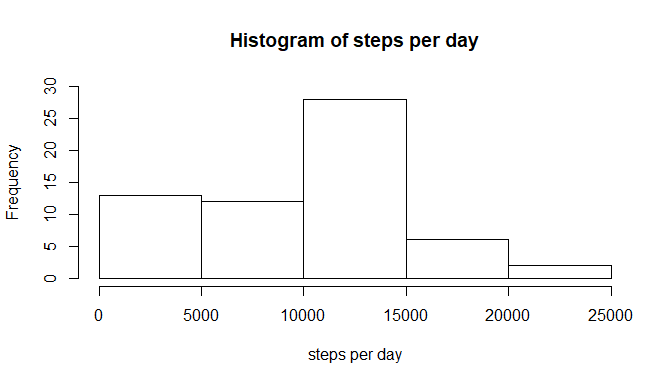
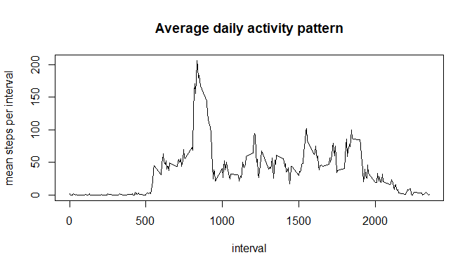
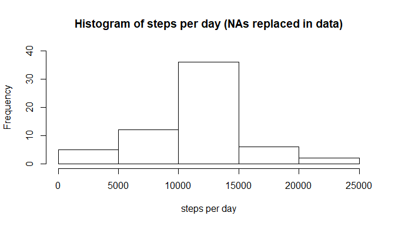
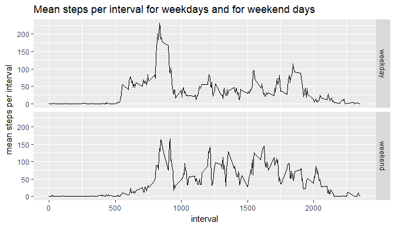

## Introduction
This assignment makes use of data from a personal activity monitoring device. This device collects data at 5 minute intervals through out the day. The data consists of two months of data from an anonymous individual collected during the months of October and November, 2012 and include the number of steps taken in 5 minute intervals each day.

## Data
The variables included in this dataset are:

* **steps**: Number of steps taking in a 5-minute interval (missing
    values are coded as `NA`)

* **date**: The date on which the measurement was taken in YYYY-MM-DD
    format

* **interval**: Identifier for the 5-minute interval in which
    measurement was taken


The dataset is stored in a comma-separated-value (CSV) file and there
are a total of 17,568 observations in this
dataset.


## Loading and preprocessing the data

First set some general options for knitr.
Then unzip the data file and read the data from the extracted file activity.csv into variable activity_data:


```r
knitr::opts_chunk$set(echo = TRUE, fig.path = "figures/")

unzip("activity.zip")

activity_data <- read.csv("activity.csv")
```

## What is mean total number of steps taken per day?

First calculate for each day the total number of steps. (The data includes measurements for 61 days, October/November 2012)

```r
steps_per_day <- with(activity_data, tapply(steps, date, sum, na.rm = TRUE))
```

Make Histogram to show frequency of steps per day:

```r
hist(steps_per_day, ylim = range(0, 30), xlab = "steps per day", main = "Histogram of steps per day")
```

<!-- -->

The Histogram shows that 10000 to 15000 steps per day are taken for nearly 50% of the days.

Now have a look at the mean and the median of the total number of steps taken per day:

```r
mean_steps_per_day <- round(mean(steps_per_day), 2)
median_steps_per_day <- median(steps_per_day)
```
The mean is 9354.23, the median is 10395.


## What is the average daily activity pattern?
First calculate the average number of steps per interval.

```r
mean_steps_per_interval <- with(activity_data, tapply(steps, interval, mean, na.rm =TRUE))
```
Then make a time series plot of the intervals (x-axis) and the average number of steps (y-axis):

```r
plot(activity_data$interval[1:288], mean_steps_per_interval, type = "l", xlab = "interval",
     ylab = "mean steps per interval", main = "Average daily activity pattern")
```

<!-- -->

Now find the interval which contains the maximum number of steps averaged across all days:

```r
max_mean_step <- max(mean_steps_per_interval)
max_name <- names(mean_steps_per_interval[mean_steps_per_interval == max_mean_step])
```
The interval with the maximum number of steps averaged across all days is interval 835.

## Imputing missing values
Calculate the total number of rows in the data set which have a missing value:

```r
count_rows_steps_NA <- sum(is.na(activity_data$steps))
```
There are 2304 rows with NA in the data set.

To replace these missing values of steps use the rounded value of mean steps per interval, i.e. for each row with no value for steps, calculate the rounded value of mean steps for the interal of that row. The result of these calculation is stored in variable
steps_complete. This vector has the same length as the data set has rows, with the number of steps from the original data set. Each NA value is then replaced by the mean steps per interval:

```r
steps_complete <- activity_data$steps
for ( i in 1:nrow(activity_data))
{
      if (is.na(steps_complete[i]))
            steps_complete[i] =
                  round(as.numeric(mean_steps_per_interval
                                   [which(names(mean_steps_per_interval) == activity_data$interval[i] )]))
}
```

With this vector of steps for all days/intervals of the data set create a new data set (variable activity_data_complete) with all NA values replaced by the average steps per interval:

```r
activity_data_complete <- data.frame(steps_complete, date = activity_data$date, interval = activity_data$interval)
```

Now calculate the total number of steps per day with the completed data set:

```r
# calculate total number of steps taken per day
steps_complete_per_day <- with(activity_data_complete, tapply(steps_complete, date, sum, na.rm = TRUE))
```

Histogram to show frequency of steps per day for completed data set:

```r
hist(steps_complete_per_day, ylim = range(0, 40), xlab = "steps per day",
     main = "Histogram of steps per day (NAs replaced in data)")
```

<!-- -->

The histogram shows that steps per day increased due to replacing NA values: There are more days with 10000 to 15000 steps and less days with steps up to 5000.

Now have a look at the mean and the median of the total number of steps taken per day for the completed data set:

```r
mean_steps_complete_per_day <- round(mean(steps_complete_per_day), 2)
median_steps_complete_per_day <- median(steps_complete_per_day)
```
The mean is 1.076564\times 10^{4}, the median is 1.0762\times 10^{4}.
These values are also increased compared to the values computed with original data set (with NAs), as by replacement of NAs the total number of steps per day increased. mean and median value are nearly the same.

## Are there differences in activity patterns between weekdays and weekends?
To decide on that question create a factor variable (day_factor) with two levels "weekday" and "weekend" to indicate whether a given date is a weekday or weekend day. Assign that factor variable to data set (without NAs) column day.

```r
# The following setting is to get english names of days.
Sys.setlocale("LC_ALL", "English")
```

```
## [1] "LC_COLLATE=English_United States.1252;LC_CTYPE=English_United States.1252;LC_MONETARY=English_United States.1252;LC_NUMERIC=C;LC_TIME=English_United States.1252"
```

```r
day <- vector(mode="character", length=nrow(activity_data_complete))
for( i in 1:nrow(activity_data_complete))
{
      weekday <- weekdays(strptime(activity_data_complete$date[i], format = "%Y-%m-%d"))
      if(weekday == "Sunday" || weekday == "Saturday")
            day[i] = "weekend"
      else
            day[i] = "weekday"
}
day_factor <- factor(day)
activity_data_complete$day <- day_factor
```
Prepare data for panel plot containing a time series plot of the intervals (x-axis) and the average number of steps taken, averaged across all weekday days or weekend days (y-axis).

```r
# split data in one set for weekend and one set for weekday
activity_data_weekend <- activity_data_complete[activity_data_complete$day == "weekend",]
activity_data_weekday <- activity_data_complete[activity_data_complete$day == "weekday",]

# calculate for each data set mean steps per interval
mean_steps_per_interval_weekend <- with(activity_data_weekend, tapply(steps_complete, interval, mean, na.rm =TRUE))
mean_steps_per_interval_weekday <- with(activity_data_weekday, tapply(steps_complete, interval, mean, na.rm =TRUE))

# Create data frame activity_data_for_panle for plot
activity_data_for_panel_weekend <- data.frame(interval = activity_data_complete$interval[1:288],
                                              mean_steps_per_interval = mean_steps_per_interval_weekend,
                                              day = activity_data_weekend$day[1:288])
activity_data_for_panel_weekday <- data.frame(interval = activity_data_complete$interval[1:288],
                                              mean_steps_per_interval = mean_steps_per_interval_weekday,
                                              day = activity_data_weekday$day[1:288])

activity_data_for_panel <- rbind.data.frame(activity_data_for_panel_weekday, activity_data_for_panel_weekend)
```
Now plot the data:

```r
library(ggplot2)
qplot(interval, mean_steps_per_interval, data = activity_data_for_panel, facets = day~. , geom ="line") + labs(y = "mean steps per interval", title = "Mean steps per interval for weekdays and for weekend days")
```

<!-- -->

The plot shows that on weekdays most steps are taken during 8:00 to 10:00. For weekend days there are also high number of steps during 8:00 to 10:00 but in contrast to weekdays there are larger number of steps taken across the day until evening ca. 21:00. 
